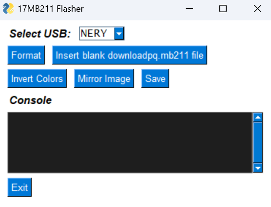

# 17MB211 Flasher

This is a lightweight utility for configuring panel settings on `17MB211` mainboards.



---

## How to Run

### 1. Install Python  
Download from [python.org](https://www.python.org/downloads/) if not already installed.

### 2. Set Up
Run the script to create a virtual environment and install dependencies:

```powershell
setup.ps1
```

### 3. Launch the Tool

Once setup is complete, start the tool using:

```powershell
EXE.ps1
```

The GUI will open and allow you to interact with the USB device and use the available functions.

---

## Requirements

- Windows
- Python 3.7+
- Packages (auto-installed):  
[`FreeSimpleGUI`](https://pypi.org/project/FreeSimpleGUI/)  
[`pyserial`](https://pypi.org/project/pyserial/)

---

### Execution Policy Error?

If you get an error like:

> `script cannot be loaded because running scripts is disabled on this system`

Run this in PowerShell:

```powershell
Set-ExecutionPolicy RemoteSigned -Scope CurrentUser
```

---

## Disclaimer

Use responsibly. Changes to panel settings can affect device functionality. The developer is not responsible for any hardware issues.

